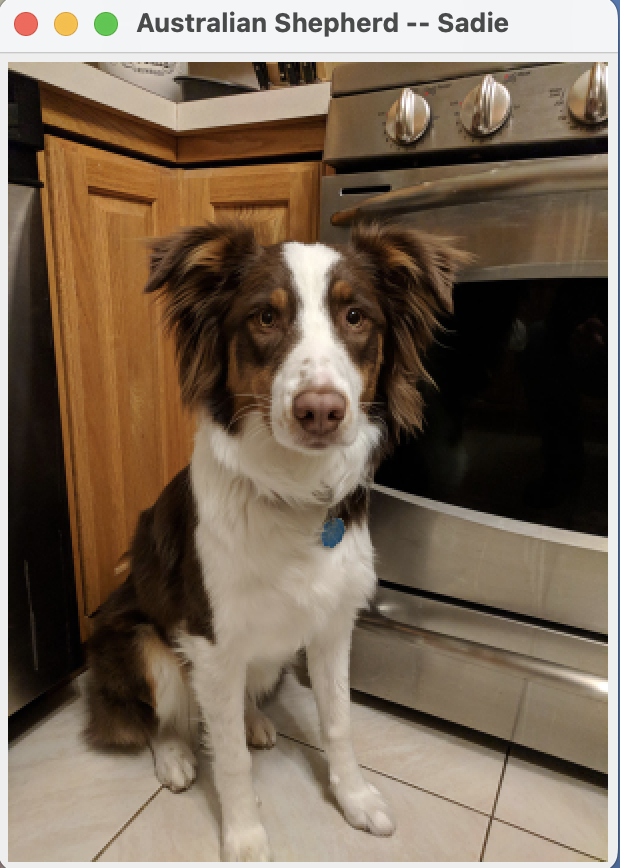

# Dog Breed Fetcher Mini-Assignment
This is worth 1/3 of your Module 2 mark, and must be submitted individually.

---

## Getting Started

This repository is a "template repository", so rather than forking it, you should create a new repository from it:

- [ ] Click the "Use this template" button in the top-right corner of this repository's page on GitHub, and create
  your own repository from this template.

> You can learn more about template repositories in the [GitHub documentation](https://docs.github.com/en/repositories/creating-and-managing-repositories/creating-a-repository-from-a-template#creating-a-repository-from-a-template).

Once you have your own repository for this assignment on GitHub, you can make a local copy
and work as usual.

---

## Objective
This mini-assignment is intended to ensure that you are comfortable programming small tasks
similar to what your team has recently done during labs. These tasks are similar to the kinds
of coding tasks you will be responsible for individually completing as part of your team project, so the
goal is for everyone to be comfortable working through such tasks independently before your
team begins the significant coding tasks for your project.

- Practice with making API calls and reading API documentation
- Work with exceptions by updating code when an unchecked exception is redesigned to be a checked exception
- Implement caching of request responses using a map

---

## Requirements
As with the NumberTriangle assignment, you need to continue to demonstrate use of Issues and PRs.
- [ ] your repo must contain at least one closed issue, one closed PR, and two commits
- [ ] all provided tests must pass

---

## Submission
Submit the URL to your repo as you did for the NumberTriangle homework.

---

## API Reference
This assignment makes use of the [Dog CEO API](https://dog.ceo/dog-api/).
The relevant part of the API is described in https://dog.ceo/dog-api/documentation/sub-breed.

Note: The example in the documentation doesn't show it, but if you specify a breed that doesn't exist, the JSON response will be:
```json
{"status":"error","message":"Breed not found (main breed does not exist)","code":404}
```

---

## Starter code
- `BreedFetcher`: Interface for fetching sub breeds
- `BreedFetcher.BreedNotFoundException`: Custom exception for invalid breeds
- `DogApiBreedFetcher`: API-based implementation using OkHttp (to implement)
- `CachingBreedFetcher`: Wrapper that caches results to avoid redundant API calls (to implement)
- `Main`: Example usage (to implement)
- `BreedFetcherForLocalTesting`: Provided implementation of `BreedFetcher` for testing purposes
- Provided JUnit tests to check your work

---

## Instructions
> Note: these tasks should be able to be completed in any order.

**Don't forget to open an Issue, work on a branch, and make a PR for your work!**

### Task 1:

- [ ] Complete the `DogApiBreedFetcher` class.

> This is probably the most involved part of the code, as
> you need to read the API documentation, make the API call,
> and parse the results. You may find it useful to refer to
> the code for making API calls from last lab, especially
> the ones for the cat facts API near the start of the readme.
> The JSON parsing code may also be useful.

### Task 2:

- [ ] Complete the `CachingBreedFetcher` class.

### Task 3:

- [ ] Complete the `Main` class.

### Task 4:

- [ ] Originally, the `BreedFetcher.BreedNotFoundException` exception was designed as a subclass of `RuntimeException`.
  Update the code so that this exception is a **checked exception** and modify any other code as needed so that the code
  is able to compile and run.

> If all tests are passing, then you have completed the assignment!

---

## Provided Testing
- `BreedFetcherTest`: Tests valid and invalid breed handling.
- `CachingBreedFetcherTest`: Verifies caching avoids redundant calls and handles exceptions properly.
- `MainTest`: Tests the static method `Main.getNumberOfSubBreeds` and that the unchecked exception has been updated to be a checked exception. 

---

## Extra Practice Task [not for credit]:

> If your team is thinking of doing something that will involve displaying
> images from the web in your UI, then this task might be a useful exercise for at
> least some members to take the time to work through and share with your team.

This API can also return URLs to pictures of dogs of a specified breed.

- [ ] Read the [documentation for this part of the API](https://dog.ceo/dog-api/documentation/breed)
    and write code to get one of these image URLs and display the image in a simple GUI.

The result might look something like this:



> For displaying the image, you can use something like the `ImageIcon` class, which
> can display an image from a provided `URL` object. Below are some potentially relevant
> documentation and tutorial pages:
> 
> https://docs.oracle.com/javase/tutorial/uiswing/components/icon.html
> 
> https://docs.oracle.com/javase/8/docs/api/javax/swing/ImageIcon.html#ImageIcon-java.net.URL-
>
> https://docs.oracle.com/javase/8/docs/api/java/net/URL.html
